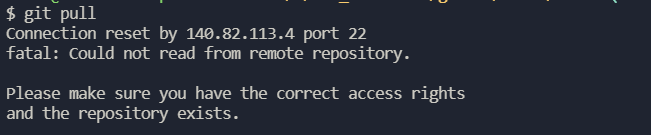

### 1. Connection reset by 140.82.113.4 port 22
  
  前一天还好好的，第二天拉代码的时候，就报了如下错误：
    
    
  试验了好多方法
  - 重新生成ssh key
  - 解除http验证
  - 网络问题，多推几次

  以上解决方法，都没生效（由于原因不明，所以不保证对读者你的问题同样不生效，欢迎尝试），我最终的解决方式如下：
  在`C:\Users\amdin\.ssh(就是放ssh key的文件夹)`下新建一个`config`文件,里边的内容如下：
  ```js
  Host github.com
      Hostname ssh.github.com
      port 443
  ```
  然后，就奇迹般的解决了。