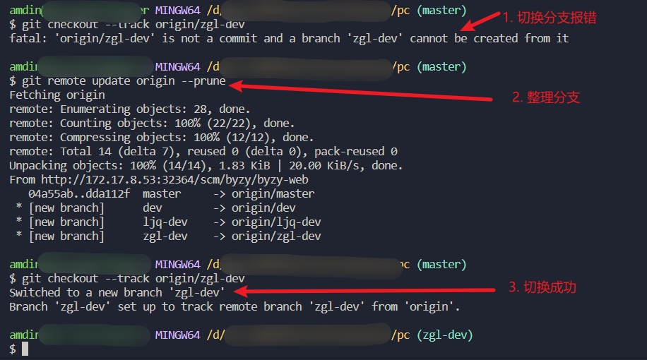

## 1. 当远程分支存在，本地分支不存在，可以使用下边的命令来快速的关联跟踪远程分支
```js
git checkout --track origin/远程分支名
```
比如以下案例，本地分支只有3个，远程分支有5个。
```js
$ git branch -a
  hzfh
* hzfh_v2
  master
  remotes/origin/HEAD -> origin/master
  remotes/origin/hzfh
  remotes/origin/hzfh_v2
  remotes/origin/master
  remotes/origin/origin/waihuv2
```
我们现在想在本地新建一个本地分支，并和远程分支`remotes/origin/origin/waihuv2`建立关联；可以使用如下命令：
```js
 git checkout --track origin/origin/waihuv2
```
然后就可以看到，本地已经多了一个分支，并且成功和远程分支`remotes/origin/origin/waihuv2`建立了关联。
```js
$ git branch -a
  hzfh
  hzfh_v2
  master
* origin/waihuv2
  remotes/origin/HEAD -> origin/master
  remotes/origin/hzfh
  remotes/origin/hzfh_v2
  remotes/origin/master
  remotes/origin/origin/waihuv2
```

## 2. git冲突解决之vscode中一键全部采用传入的更改
当你的某个文件中，希望全部采用传入的更改，如果一个一个的去点击的话，太浪费时间了。可以有如下的简单操作，按`ctrl+shift+p`调出顶部的命令行窗口，然后输入`merge`,选择`Merge Conflict:Accept All Incoming`就可以瞬间搞定啦！

## 3. 更新远程主机origin,整理分支
```js
git remote update origin --prune 
```
有时候我们在切分支的时候会出现如下问题`fatal: 'origin/zgl-dev' is not a commit and a branch 'zgl-dev' cannot be created from it`,是因为本地没有关联到远程新建的分支。用上边的命令整理一下分支就可以了。


### 4. 查看本地分支和远程分支对应关系
```js
git branch -vv 
```

  