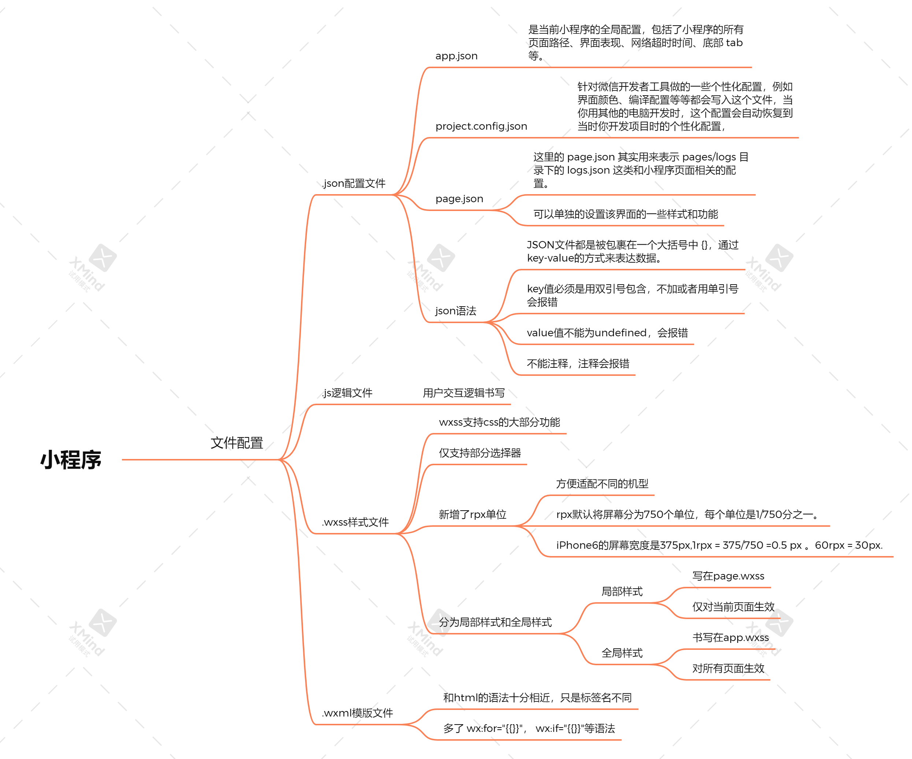
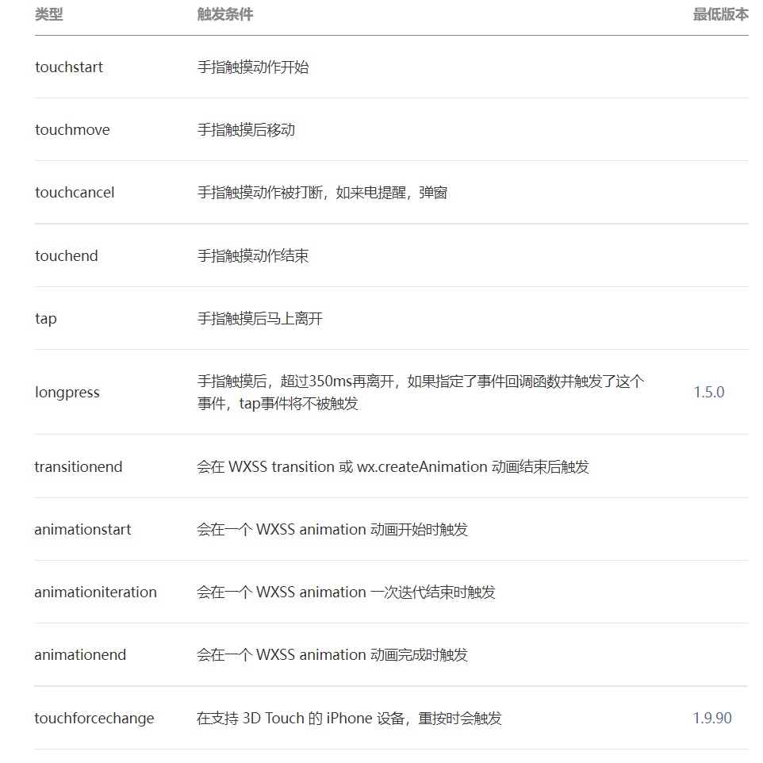

## 一、小程序指南
### 1. 小程序与普通网页开发的区别
1. ​网页开发渲染线程和脚本线程是互斥的，长时间的脚本运行可能会导致页面失去响应；而小程序的逻辑层和渲染层是分开的，可以并行运行。
2. 网页开发有一套完整的DOM和BOM API可供操作，而小程序并没有一个完整浏览器对象，因而缺少相关的DOM和BOM API,导致了jQuery、 Zepto 等库在小程序中是无法运行的；
3. 小程序的逻辑层运行在 JSCore 中，JSCore 的环境同 NodeJS 环境也是不尽相同，所以一些 NPM 的包在小程序中也是无法运行的。

### 2. 小程序代码构成


### 3. 小程序的宿主环境
微信客户端给小程序所提供的环境为宿主环境。小程序借助宿主环境提供的能力，可以完成许多普通网页无法完成的功能。
1. 渲染层和逻辑层
小程序的渲染层(wxss,wxml)和逻辑层(js)是两个线程分开管理的,一个小程序存在多个界面，所以渲染层存在多个WebView线程，这两个线程的通信会经由微信客户端（下文中也会采用Native来代指微信客户端）做中转，逻辑层发送网络请求也经由Native转发，小程序的通信模型下图所示。

2. 程序与页面
微信客户端在打开小程序之前，会把整个小程序的代码包下载到本地。紧接着通过读取 `app.json`中的`pages`字段就可以知道你当前小程序的所有页面路径。而写在`pages`字段的第一个页面就是这个小程序的首页（打开小程序看到的第一个页面）
小程序启动之后，在`app.js`定义的`App`实例的`onLaunch`回调会被执行,整个小程序只有一个`App`实例，是全部页面共享的。
在生成渲染一个页面时，微信客户端首先会读取.json配置文件，然后读取.js文件(page是一个页面构造器，),并结合wxml和wxss文件,进行渲染，最终生成页面。在渲染完界面之后，页面实例就会收到一个 onLoad 的回调，你可以在这个回调处理你的逻辑。

### 4. 目录结构
小程序包含一个描述整体程序的`app`和多个描述各自页面的`page`,一个小程序主体部分由三个文件组成(`app.js`、`app.json`、`app.wxss`)，必须放在项目的根目录，<span style="color:red;font-weight:bolder">为了方便开发者减少配置项，描述页面的四个文件(`index.js`、`index.json`、`index.wxss`、`index.wxml`)必须具有相同的路径与文件名</span>。

<span style="color:red;font-weight:bolder">小程序能够使用的文件类型是有限的</span>，仅有在白名单中的文件可以上传，不在白名单中的文件类型，可以在开发者工具中使用，但是无法上传部署(会导致报错！)，具体的白名单如下：`wxs`、`png`、`jpg`、`jpeg`、`gif`、`svg`、`json`、`cer`、`mp3`、`aac`、`m4a`、`mp4`、`wav`、`ogg`、`silk`、`wasm`、`br`、`cert`

### 5. sitemap 配置
`sitemap.json`配置文件也是放置于小程序的根目录下的，该文件主要是用于配置小程序内的页面是否允许被爬虫获取信息。<span style="color:red;font-weight:bolder">没有`sitemap.json`文件，则默认所有页面都能被索引</span>
```json
{
  "rules":[{
    "action": "allow",
    "page": "path/to/page"
  }, {
    "action": "disallow",
    "page": "*"
  }]
}
// 配置 path/to/page 页面被索引，其余页面不被索引
```


### 6. 小程序框架
#### 1. 核心
框架的核心是一个响应的数据绑定系统，可以让数据与视图非常简单地保持同步。<span style="color:red;font-weight:bolder">当做数据修改的时候，只需要在逻辑层修改数据，视图层就会做相应的更新。</span>
#### 2. 场景值
场景值是用于记录用户是从什么入口进入小程序的。在小程序中可以在`App`的`onLaunch`和 `onShow`，或`wx.getLaunchOptionsSync`中获取上述场景值。
#### 3. 逻辑层
逻辑层将数据进行处理后发送给视图层，同时接受视图层的事件反馈。
##### 1.注册小程序
每个小程序都需要在`app.js`中调用`App`方法注册小程序实例，绑定生命周期回调函数、错误监听和页面不存在监听函数等。
详细的参数含义和使用请参考 [App 参考文档 ](https://developers.weixin.qq.com/miniprogram/dev/reference/api/App.html)。
```js
// app.js
App({
  onLaunch (options) {
    // Do something initial when launch.
  },
  onShow (options) {
    // Do something when show.
  },
  onHide () {
    // Do something when hide.
  },
  onError (msg) {
    console.log(msg)
  },
  globalData: 'I am global data'
})
```
<span style="color:red;font-weight:bolder">整个小程序只有一个`App`实例，是全部页面共享的。</span>开发者可以通过`getApp`方法获取到全局唯一的`App`实例，获取App上的数据或调用开发者注册在`App`上的函数。
```js
// xxx.js
const appInstance = getApp()
console.log(appInstance.globalData) // I am global data
```

##### 2. 注册页面
对于小程序中的每个页面，都需要在页面对应的 js 文件中进行注册，指定页面的初始数据、生命周期回调、事件处理函数等。
在注册页面时，可以用`Page`构造器或者`Component`构造器来进行，`Component`构造器的主要区别是：方法需要放在`methods: { }`里。
```js
//用Page来注册
Page({
  data: {
    text: "This is page data."
  },
  onLoad: function(options) {
    // 页面创建时执行
  },
// 。。。其他生命周期

  // 事件响应函数
  viewTap: function() {
    this.setData({
      text: 'Set some data for updating view.'
    }, function() {
      // this is setData callback
    })
  },
  // 自由数据
  customData: {
    hi: 'MINA'
  }
})
```
用`Component`进行注册
```js
Component({
  data: {
    text: "This is page data."
  },
  methods: {
    onLoad: function(options) {
      // 页面创建时执行
    },
    onPullDownRefresh: function() {
      // 下拉刷新时执行
    },
    // 事件响应函数
    viewTap: function() {
      // ...
    }
  }
})
```

##### 3. 路由
小程序的路由调整主要分为tab切换和非tab切换。详情见官网。[官方文档](https://developers.weixin.qq.com/miniprogram/dev/framework/app-service/route.html)。

##### 4. 模块化 (支持es6模块化)
可以将一些公共的代码抽离成为一个单独的 js 文件，作为一个模块。模块只有通过 `module.exports`才能对外暴露接口。
```js
function sayHello(name) {
  console.log(`Hello ${name} !`)
}
function sayGoodbye(name) {
  console.log(`Goodbye ${name} !`)
}

module.exports.sayHello = sayHello
```
​在需要使用这些模块的文件中，使用 require 将公共代码引入
```js
var common = require('common.js')
Page({
  helloMINA: function() {
    common.sayHello('MINA')
  },
  goodbyeMINA: function() {
    common.sayGoodbye('MINA')
  }
})
```


#### 4. 视图层
##### 1. 事件系统
1. 小程序在绑定事件时不能直接传参，可以将需要传递的参数，用`data-`的形式存到组件上，然后在事件回调中，通过`event.target.dataset.xxx`的形式来获取。
```js
// index.wxml
<view id="tapTest" data-hi="Weixin" bindtap="tapName"> Click me! </view>

// index.js
Page({
  tapName: function(event) {
    console.log(event)
  }
})

// 打印的结果
{
  "type":"tap",
  "timeStamp":895,
  "target": {
    "id": "tapTest",
    "dataset":  {
      "hi":"Weixin"
    }
  },
  "currentTarget":  {
    "id": "tapTest",
    "dataset": {
      "hi":"Weixin"
    }
  },
  "detail": {
    "x":53,
    "y":14
  },
  "touches":[{
    "identifier":0,
    "pageX":53,
    "pageY":14,
    "clientX":53,
    "clientY":14
  }],
  "mark":{},
  "changedTouches":[{
    "identifier":0,
    "pageX":53,
    "pageY":14,
    "clientX":53,
    "clientY":14
  }]
}
```

2. 在小程序的事件系统中，大多数事件都是冒泡的。用`bind`绑定这些事件就会冒泡，用`catch`则会自动阻止事件冒泡。


```js
<view id="outer" bindtap="handleTap1">
  outer view
  <view id="middle" catchtap="handleTap2">
    middle view
    <view id="inner" bindtap="handleTap3">
      inner view
    </view>
  </view>
</view>
// 点击 inner view 会先后调用handleTap3和handleTap2(因为tap事件会冒泡到 
//middle view，而 middle view 阻止了 tap 事件冒泡，不再向父节点传递)，点
//击 middle view 会触发handleTap2，点击 outer view 会触发handleTap1。
```
1. `event`事件对象中的`mark`属性。
当事件触发时，事件冒泡路径上所有的`mark`会被合并，并返回给事件回调函数.(即使事件不是冒泡事件，也会`mark`)
```js
// page.wxml
<view mark:myMark="last" bindtap="bindViewTap">
  <button mark:anotherMark="leaf" bindtap="bindButtonTap">按钮</button>
</view>

// page.js
Page({
  bindViewTap: function(e) {
    e.mark.myMark === "last" // true
    e.mark.anotherMark === "leaf" // true
  }
})
```
如果按钮被点击，将触发`bindViewTap`和`bindButtonTap`两个事件，事件携带的`event.mark`将包含`myMark`和`anotherMark`两项。

`mark`和`dataset`很相似，主要区别在于：`mark`会包含从触发事件的节点到根节点上所有的 `mark:`属性值；而`dataset`仅包含一个节点的`data-`属性值。
- 如果存在同名的`mark`，父节点的`mark`会被子节点覆盖。
- 在自定义组件中接收事件时，`mark`不包含自定义组件外的节点的`mark`。
- 不同于`dataset`，节点的`mark`不会做连字符和大小写转换。


##### 2. 双向绑定
在小程序中的数据绑定是单项的。
```js
<input value="{{value}}" />
```
如果使用`this.setData({ value: 'leaf' })`来更新`value`,`this.data.value`和输入框的中显示的值都会被更新为`leaf`；但如果用户修改了输入框里的值，却不会同时改变`this.data.value`。

如果需要在用户输入的同时改变`this.data.value`，需要借助简易双向绑定机制。此时，可以在对应项目之前加入`model:`前缀：
```js
<input model:value="{{value}}" />
```
这样，如果输入框的值被改变了， `this.data.value`也会同时改变。同时，`WXML`中所有绑定了`value`的位置也会被一同更新， 数据监听器 也会被正常触发。
但是，小程序的双向绑定还存在如下缺陷
```js
<input model:value="值为 {{value}}" />
<input model:value="{{ a + b }}" />
<input model:value="{{ a.b }}" />
// 以上的做法都是非法的，会导致报错
```

##### 3. 初始渲染缓存
在小程序进行初始化时，需要经过逻辑层初始化和视图层初始化才能将页面给呈现出来给用户，在小程序冷启动时，通常需要较长时间才能进入页面，为了避免较长时间的白屏情况，可以使用初始渲染缓存的方法，将一部分原始数据先展示出来给用户（类似骨架屏）。
