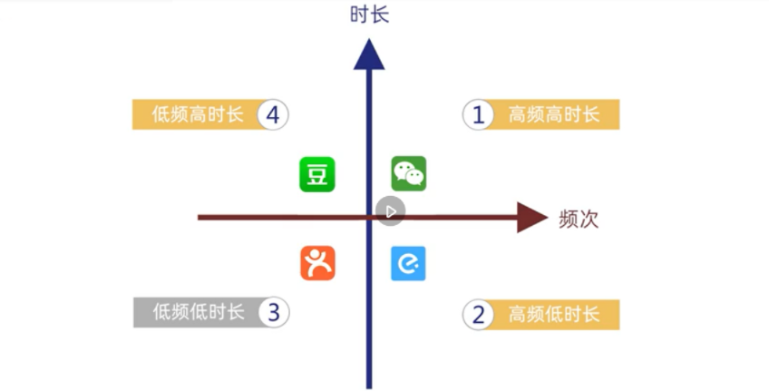
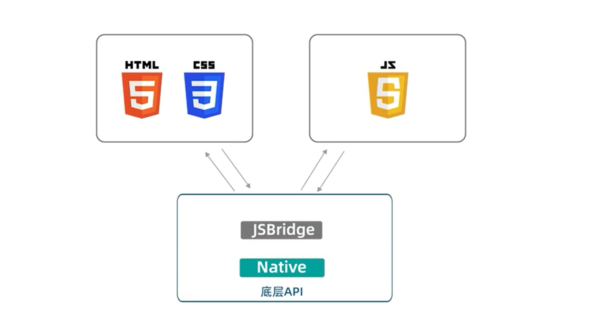
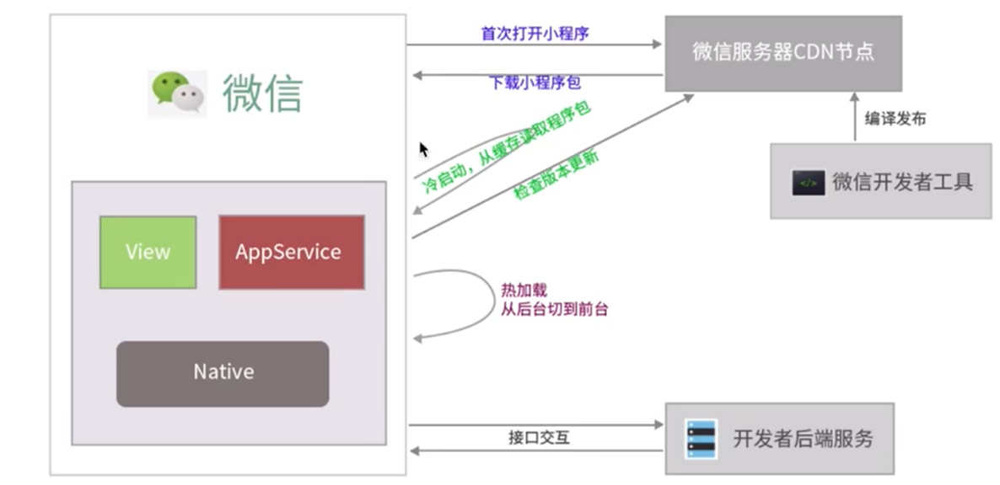
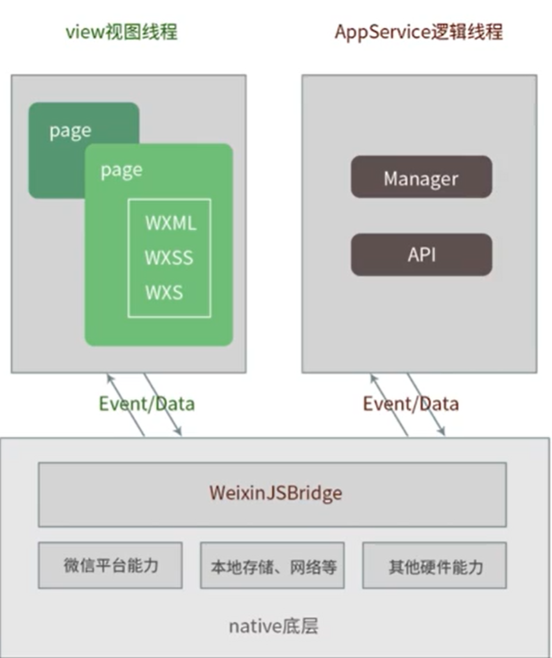

### 学习小程序的价值和意义
1. 从用户体验角度考虑--小程序顺应了时代需要
     - 相比于app,避免了下载和安装
     - 相比于web端，避免了每次打开页面都要重新渲染
2. 从商户运营的角度考虑--你需要小程序
    
   - 可以用小程序引流
3. 从开发的角度--小程序走到了技术前沿
    - 在小程序出现前，由于Hybrid混合开发同时具有App良好的交互体验和Web跨平台开发的优势，风靡一时,其主要原理如下：
    
        - 用JSBridge来提供统一的底层API
        - 用HTML+CSS实现界面
        - 用JS来处理页面逻辑，调用底层的API和后端接口
        - 最终在Webview中渲染展示
    - 小程序的优势有如下
      - 审核周期短，平均2天左右
      - 微信日活量高

### 学习小程序的建议
1. 知行合一致良知
2. 踏实坚持积少成多

### 小程序的特点
1. 依赖于微信，不用浏览器打开
2. 以JS为主要语言
3. 学习成本低，上手快
4. 不需要下载安装

### 小程序的开发能力
1. 小程序和公众号可以重名
2. 小程序开放群相关的能力
3. 小程序具有附近的小程序功能
4. 星标功能
5. 可以关联500个公众号
6. 可以直接打开网页
7. 灰度更新和线上版本回退功能
8. 客服可以配置

### 开发小程序的一般流程
1. 注册
2. 小程序信息完善
3. 开发小程序
4. 提交审核和发布

### 小程序的运行机制
1. 小程序的两种启动方式
从用户认知的角度看，广义的小程序启动可以分为两种情况，一种是冷启动，一种是热启动。
    - 冷启动：如果用户首次打开，或小程序销毁后被用户再次打开，此时小程序需要重新加载启动，即冷启动。
    - 热启动：如果用户已经打开过某小程序，然后在一定时间内再次打开该小程序，此时小程序并未被销毁，只是从后台状态进入前台状态，这个过程就是热启动。

    从小程序生命周期的角度来看，我们一般讲的「启动」专指冷启动，热启动一般被称为后台切前台。

2. 小程序的双线程机制
    

3.  小程序的生命周期
   
   

