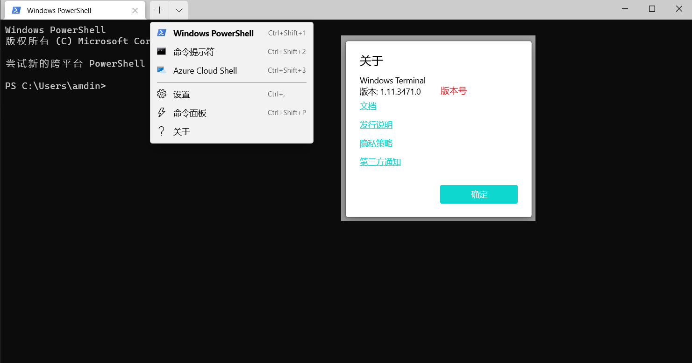
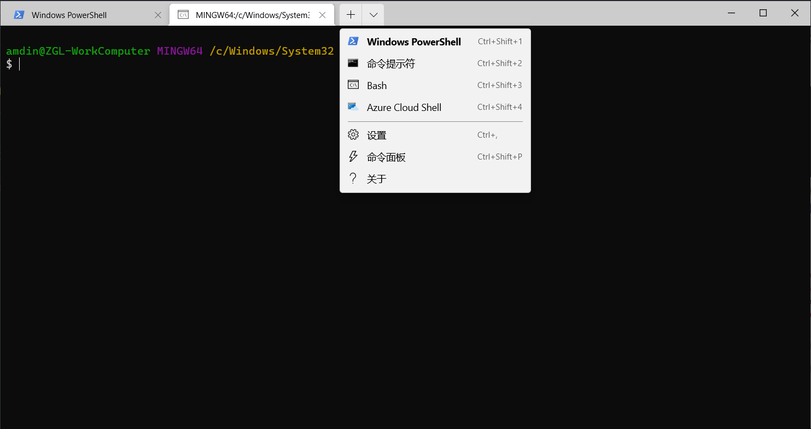

## 1. windows Terminal 配置Bash
在自己的电脑上安装了一个`windows Terminal`默认配置是没有`Bash`的，今天百度一番配置上了`Bash`。
本机上的版本号以及初始的状态如下：

打开`设置`，然后点击最下边的`打开JSON文件`,你就可以在默认的编辑器中看到相对应的配置信息。在list字段下加入以下对象信息，然后保存即可。
```Json
{
    "guid": "{4b495c9a-fc62-4b94-ae40-2a5b470d9cd9}",
    "name": "Bash",//tab栏上显示的名称
    "commandline": "D:\\ZGL_WORKSPACE\\Tools\\gitBash\\Git\\bin\\bash.exe",//你的bash安装路径，注意反斜杠转义
    "hidden": false
},
```
`guid`字段是一个终端配置标识，可以在[这个网站](https://www.guidgen.com/)生成一个。

最终效果如下:



## 2. 各种快捷键
### 1. 浏览器类
1. 在浏览网页时，想要快速的回到网页的顶部可以按`ctrl + Home`键，如果想回到网页底部可以按`ctrl + End`键。
2. 