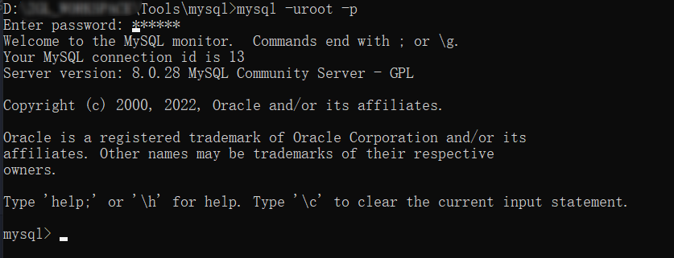

### 1. cmd窗口操作数据库常用命令
> 注意，请用管理员打开，否则可能会出错。


1. 启动关闭mysql

    ```sql
    net start mysql;//启动mysql服务
    net stop mysql;//关闭mysql服务
    ```
2. 连接mysql

    ```sql
    mysql -uroot -p;
    然后输入密码，出现如下图片说明连接成功
    ```
    
3. 断开连接

    ```sql
    exit;//注意，sql语句需要以;结尾
    ```
4. 查看mysql中的所有的数据库
   ```sql
    show databases;
   ```
5. 使用某个库
    ```sql
    use 库名;//这个操作后，后续的所有命令都是针对这个库的。
    ```
6. A表(teachers)的主键被B表引用为外键，A主键添加自增约束报错

    ```sql
    SET FOREIGN_KEY_CHECKS = 0;//关闭外键检查
    ALTER TABLE test.teachers MODIFY COLUMN id int auto_increment NOT NULL; //执行字增
    SET FOREIGN_KEY_CHECKS = 1; // 开启外键检查
    ```