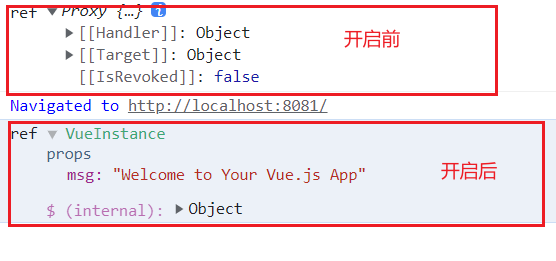

### 1. 提升用户的开发体验
1. 提供良好的报错信息，`Vue`通过`warn`函数尽可能的提供了良好的报错提示信息。
2. `Vue`通过`initCustomFormatter`函数来提供了自定义输出，在谷歌浏览器中通过勾选`Enable custom formatters`可以调用该函数，让我们的输出更为直观。以下是开启这个功能前后的输出差异。


### 2. 控制框架代码的体积
我们都知道一个常识，当一个框架提供的报错信息越详细时，其对应的代码就会越臃肿。最后浏览器加载资源所用的时间也就越长。`Vue`通过`__DEV__`这个常量来配合`warn`函数控制报错信息的输出。当是开发环境时，该常量为`true`，报错能正常输出。当构建生产环境的资源时，该常量会被设置为`false`，然后其内部的报错信息因为永远不可能执行而变成了`dead code` ，在构建时这些代码就会被移除。因此在`vue.global.prod.js`中是不存在这段代码对的。通过这种设置`Vue`就做到了**在开发环境中为用户提供友好的警告信息的同时，不会增加生产环境代码的体积**。
```js
if(__DEV__ && !res){
    warn('xxxxxx')
}
```
### 3. 框架要做到良好的Tree-Shaking