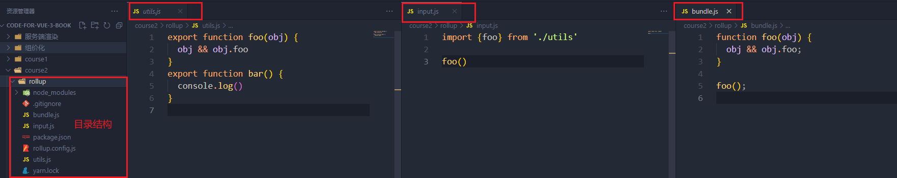
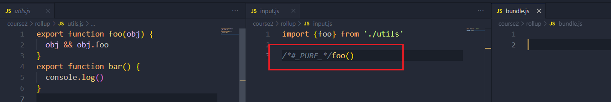

### 1. 提升用户的开发体验

1. 提供良好的报错信息，`Vue`通过`warn`函数尽可能的提供了良好的报错提示信息。
2. `Vue`通过`initCustomFormatter`函数来提供了自定义输出，在谷歌浏览器中通过勾选`Enable custom formatters`可以调用该函数，让我们的输出更为直观。以下是开启这个功能前后的输出差异。
   

### 2. 控制框架代码的体积

我们都知道一个常识，当一个框架提供的报错信息越详细时，其对应的代码就会越臃肿。最后浏览器加载资源所用的时间也就越长。`Vue`通过`__DEV__`这个常量来配合`warn`函数控制报错信息的输出。当是开发环境时，该常量为`true`，报错能正常输出。当构建生产环境的资源时，该常量会被设置为`false`，然后其内部的报错信息因为永远不可能执行而变成了`dead code` ，在构建时这些代码就会被移除。因此在`vue.global.prod.js`中是不存在这段代码对的。通过这种设置`Vue`就做到了**在开发环境中为用户提供友好的警告信息的同时，不会增加生产环境代码的体积**。

```js
if (__DEV__ && !res) {
  warn('xxxxxx')
}
```

### 3. 框架要做到良好的 Tree-Shaking

#### 3.1 什么是 Tree-shaking?

简单的说，`Tree-Shaking`指的就是消除永远不会被执行的代码，也就是排除`dead code`，无论是`rollup`还是`webpack`均支持`Tree-Shaking`。

#### 3.2 使用 Tree-Shaking 的两个关键点

1. 由于`Tree-Shaking`依赖`ESM`的静态结构，所以模块必须使用`ESM`；想要了解什么是`ESM`，推荐阮一峰大佬的教程[Module 语法](https://wangdoc.com/es6/module)。
2. 如果一个函数调用会产生副作用，那么就不能将其移除。
   - 什么是副作用？ 简单来说，就是函数调用时侯会对外部生产影响，比如修改了某个全局变量的值。

下边我们来看两个 demo

- demo1 的目录结构以及各个文件的内容如下图，注意在`input.js`中我们只引入了`foo`函数，没有用到`bar`函数。
  
  当我们执行`yarn add rollup -D`（安装`rollup`） 和 `npx rollup input.js -f esm -o bundle.js`(以`input.js`左右入口，以`bundle.js`作为输出文件，输出的格式为`ESM`)命令后，可以看到在最后的`bundle.js`中只有`foo`函数，没有`bar`函数，所有`Tree-Shaking`起作用了。

- demo2 的目录结构和 demo1 一样，仅仅是在`input.js`的文件中，给`foo`函数前边加上了`/*#_PURE_*/`标志，再次执行完打包命令后，可以看到输出的`bundle.js`文件为空文件了。
  
  `JavaScript`本身是动态语言，想要静态的分析哪些代码是`dead code`是非常困难的，于是`rollup`这类工具提供了一个标志`/*#_PURE_*/`，这个标志的作用就是，告诉`rollup.js`“后边这段代码，不会产生副作用，你可以放心的移除它”。

根据 JS 的特点我们可以知道，一般顶级调用（在全局作用域中直接调用，而不是在函数内部调用）中容易产生副作用，所以`Vue.js3`中在一些顶级调用的函数上会使用`/*#_PURE_*/`标志。

**webpack、 terser 等工具均支持`/*#_PURE_*/`标志**

### 4. Vue.js 输出的构建产物

#### 4.1 通过`<script>`标签引入的 iife 格式

用户可以在 Html 中直接通过`<script src="https://cdn.bootcdn.net/ajax/libs/vue/3.2.41/vue.global.js"></script>`标签引入 Vue 框架并立即使用。为了满足用户的该需求，Vue.js 提供了`IIFE`（Immediately Invoked Function Expression）（立即调用函数表达式）格式的资源，其代码结构如下：

```js
var Vue = (function (exports) {
  // ...
  exports.createApp = createApp
  // ...
  return exports
})()
```

在 rollup.js 中，我们可以通过`format:'iife'`来输出这种形式的资源

```js
#rollup.config.js
const config = {
    input:"input.js",
    output:{
        file:"output.js",
        format:"iife"
    }
}
```

#### 4.2 通过`<script type='module'>`标签引入的 esm 格式

浏览器发展至今，主流的浏览器都支持了 ESM。所以用户也可以直接通过`<script src="https://cdn.bootcdn.net/ajax/libs/vue/3.2.41/vue.esm-browser.js"></script>`标签进行引入 Vue 框架。

为了输出 ESM 格式的资源，`rollup.js`的配置项只需要修改`format:'esm'`即可。

`vue.esm-browser.js`中的`-browser`是为了用来表示这个格式的资源到底是给通过 script 标签直接引用的，`-bundler`表示是给构建工具使用的。无论`rollup.js`还是`webpack`，在寻找资源时，如果`package.json`中存在`module`字段，那么会优先使用`module`字段指向的资源来替代`main`字段指向的资源。在 Vue 的源码中的`packages/vue/packag.json`中有如下代码：

```js
{
    "main":"index.js",
    "module":"dist/vue.runtime.esm-bundler.js"
}
```

在上文提到的`__DEV__`变量根据开发/生产环境会自动被设置为`true/false`，是存在于`-browser`资源中的，在`-bundler`资源中，使用的是`process.env.NODE_ENV !== 'PRODUCTION'` 来替代该常量的。

#### 4.3 在 Node.js 中通过 require 引入的 cjs 格式

为了满足服务端渲染的需求`Vue`提供了`cjs`模式的资源。`rollup.js`的配置项只需要修改`format:'cjs'`即可。

### 5. 特性开关

在框架设计中，框架通常会提供很多特性/功能来共用户使用，比如提供了 A、B、C 三个功能，同时提供了 a、b、c 三个特性开关来控制这三个功能的启用与否。这样做有如下两点好处

- 对于用户关闭的特性，可以利用 Tree-Shaking 来去除代码，减少代码的最终体积，提升加载速度
- 让框架的设计变得更加的灵活，可以通过特性开关为框架添加新的特性。当框架升级时，特性开关可以用于让用户选择是否使用遗留的 API。

特性开关的实现，其实还是利用的**rollup.js 的预定义常量**来实现的。Vue3 的源码中有如下代码：

```js
_FEATURE_OPTIONS_API_: isBundlerESMBuild ? `_VUE_OPTIONS_API_` : true
```

其中的`_FEATURE_OPTIONS_API_`类是于`__DEV__`。在 Vue3 的源码中有很多类是于如下代码的分支判断：

```js
// support for 2.x options
if (_FEATURE_OPTIONS_API_) {
  currentInstance = instance
  pauseTraking()
  applyOptions(instance, Component)
  resetTraking()
  currentInstall = null
}
```

当 Vue 构建资源时，如果构建的是资源是共打包工具使用的`（带-bundler）`的，如上代码就会变为：

```js
// support for 2.x options
if (_VUE_OPTIONS_API_) {
  currentInstance = instance
  pauseTraking()
  applyOptions(instance, Component)
  resetTraking()
  currentInstall = null
}
```

其中，`_VUE_OPTIONS_API_`是一个特性开关（该特性开关是用来决定是否保留 vue2 的选项 API 模式还是完全采用 vue3 的`Composition API`模式），同常用户可以使用 webpack.DefinePlugin 插件来实现

```js
new webpack.DefinePlugin({
  _VUE_OPTIONS_API: JSON.stringfy(true) // 开启特性
})
```

### 6. 错误处理

Vue3.js 提供了`registerErrorHandler`函数，用户可以使用它注册错误处理程序，然后在`callWithErrorHanding`函数内部捕获错误后，把错误传递给用户注册的错误处理程序，让用户来灵活的处理报错。

```js
let handleError = null;
export default = {
    foo(fn){
        callWithErrorHandling(fn)
    },
    // 用户可以调用该函数注册统一的错误处理函数
    registerErrorHandler(fn){
        handleError = fn
    }
}

function callWithErrorHandling(fn){
    try{
        fn && fn()
    }catch(e){
        // 将捕获到的错误传递给用户的错误处理程序
        handleError(e)
    }
}

```
