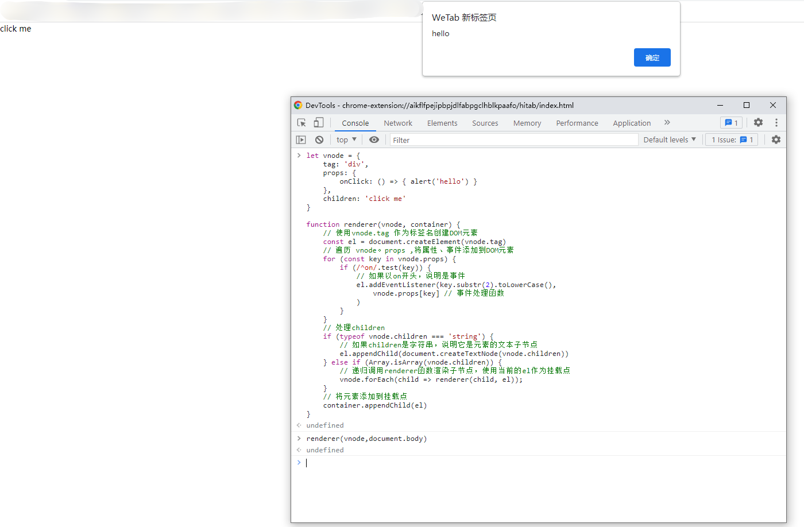

### 1. 声明式地描述UI
我们都知道在写前端页面的时候，通常会涉及以下内容：
  - DOM元素：例如写的是div标签还是a标签
  - 属性：比如a标签的href属性，id、class等通用属性
  - 事件：比如click、keydown等
  - 元素的层级结构：Dom树的层级结构，既有子节点，又有父节点等


Vue.js在描述前端的页面时，基本与上述的一致，并且新增了许多模版语法：
  - 使用:或者v-bind来描述动态绑定的属性,eg：`<div :id="testId"></div>`
  - 使用@或者v-on来描述事件，eg:`<div @click="handleClick"></div>`
  - ......

正是有了这些模版语法，让我们不用去写命令的代码（比如原生的绑定事件），这就是所谓的**声明式描述UI**。

除了使用这种模版来声明式的描述UI外，我们还可以用JS对象来描述，比如：
```js
const title = {
  tag:'h1',
  props:{
    onClick:handler
  },
  children:[
    {
      tag:'span'
    }
  ]
}
```
其实，上边的代码对应到Vue.js模版就是`<div @click="handler"><span></span></div>`
虽然，这种用JS来描述UI的方式对程序员来不够友好，但是它是很灵活的。比如有这样一个需求：我们要表示一个标题，根据标题级别的不同，我们会分别采用h1~h6这几个标签，用JS的代码的方式可以如下：
```js
let level = 3
const title = {
  tag:`h${level}` // h3标签
}
```
但是如果用模版语法来写的话，我们就得穷举了。
```js
<h1 v-if="level === 1"></h1>
<h1 v-else-if="level === 2"></h1>
<h1 v-else-if="level === 3"></h1>
<h1 v-else-if="level === 4"></h1>
<h1 v-else-if="level === 5"></h1>
<h1 v-else-if="level === 6"></h1>
```
这种通过JS对象来描述UI的方式，就是所谓的**虚拟Dom**

在Vue.js中，组件中手写的渲染函数就是使用虚拟Dom来描述UI的，代码如下;
```js
import {h} from 'vue'
export default {
  render(){
    return h('h1',{onClick:hanler}) // h函数返回的就是一个虚拟Dom
  }
}
```
**渲染函数h是一个辅助创建虚拟Dom的工具函数**
### 2. 初识渲染器
什么是渲染器？ 渲染器就是将虚拟DOM变为真实DOM的一个函数对象。


下边我们来写一个简单的渲染器
首先我们先定义一个虚拟DOM
```js
let vnode = {
    tag:'div',
    props:{
        onClick:()=>{alert('hello')}
    },
    children:'click me'
}
```
接下来编写一个渲染器：
```js
function renderer(vnode, container) {
    // 使用vnode.tag 作为标签名创建DOM元素
    const el = document.createElement(vnode.tag)
    // 遍历 vnode。props ,将属性、事件添加到DOM元素
    for (const key in vnode.props) {
        if (/^on/.test(key)) {
            // 如果以on开头，说明是事件
            el.addEventListener(key.substr(2).toLowerCase(),
                vnode.props[key] // 事件处理函数
            )
        }
    }
    // 处理children
    if (typeof vnode.children === 'string') {
        // 如果children是字符串，说明它是元素的文本子节点
        el.appendChild(document.createTextNode(vnode.children))
    } else if (Array.isArray(vnode.children)) {
        // 递归调用renderer函数渲染子节点，使用当前的el作为挂载点
        vnode.forEach(child => renderer(child, el));
    }
    // 将元素添加到挂载点
    container.appendChild(el)
}
```
我们可以随意的打开一个网页的控制台，然后**删除body里边的所有元素，使页面空白**，然后将上边的vnode和renderer函数在控制台中定义好，然后在调用`renderer(vnode,document.body)`,页面就会出现`click me`元素啦！然后点击，就会出现如下效果，说明咋们写的简易渲染器是有效的！


现在我们来分析一下renderer实现的思路，总体的来说分为三步：
  - 创建元素：将出入的vnode.tag作为标签名称来创建DOM元素；
  - 为元素添加事件和属性：遍历vnode的props,如果key值以on开头的话，说明它是一个事件，把on截取掉然后在转为小写，得到合法的事件名称，最后调用addEventListener绑定事件处理函数
  - 处理children:如果children是一个数组，就需要递归调用renderer函数，需要注意的是**我们要把刚刚创建的元素作为挂载点**;如果children是字符串，则使用createTextNode创建一个文本节点，并将其挂载到新创建的元素上。


**渲染器的精髓不在于初次创建节点，而是在更新节点阶段**，如果我们传入的vnode发生了一点儿变化，渲染器需要精准的找到发生变化的点，并且做到只更新变化的地方，这在后续会继续讲解！