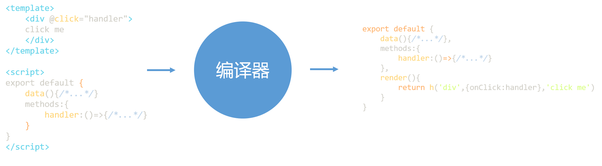

### 1. 声明式地描述UI
我们都知道在写前端页面的时候，通常会涉及以下内容：
  - DOM元素：例如写的是div标签还是a标签
  - 属性：比如a标签的href属性，id、class等通用属性
  - 事件：比如click、keydown等
  - 元素的层级结构：Dom树的层级结构，既有子节点，又有父节点等


Vue.js在描述前端的页面时，基本与上述的一致，并且新增了许多模版语法：
  - 使用:或者v-bind来描述动态绑定的属性,eg：`<div :id="testId"></div>`
  - 使用@或者v-on来描述事件，eg:`<div @click="handleClick"></div>`
  - ......

正是有了这些模版语法，让我们不用去写命令的代码（比如原生的绑定事件），这就是所谓的**声明式描述UI**。

除了使用这种模版来声明式的描述UI外，我们还可以用JS对象来描述，比如：
```js
const title = {
  tag:'h1',
  props:{
    onClick:handler
  },
  children:[
    {
      tag:'span'
    }
  ]
}
```
其实，上边的代码对应到Vue.js模版就是`<div @click="handler"><span></span></div>`
虽然，这种用JS来描述UI的方式对程序员来不够友好，但是它是很灵活的。比如有这样一个需求：我们要表示一个标题，根据标题级别的不同，我们会分别采用h1~h6这几个标签，用JS的代码的方式可以如下：
```js
let level = 3
const title = {
  tag:`h${level}` // h3标签
}
```
但是如果用模版语法来写的话，我们就得穷举了。
```js
<h1 v-if="level === 1"></h1>
<h1 v-else-if="level === 2"></h1>
<h1 v-else-if="level === 3"></h1>
<h1 v-else-if="level === 4"></h1>
<h1 v-else-if="level === 5"></h1>
<h1 v-else-if="level === 6"></h1>
```
这种通过JS对象来描述UI的方式，就是所谓的**虚拟Dom**

在Vue.js中，组件中手写的渲染函数就是使用虚拟Dom来描述UI的，代码如下;
```js
import {h} from 'vue'
export default {
  render(){
    return h('h1',{onClick:hanler}) // h函数返回的就是一个虚拟Dom
  }
}
```
**渲染函数h是一个辅助创建虚拟Dom的工具函数**
### 2. 初识渲染器
什么是渲染器？ 渲染器就是将虚拟DOM变为真实DOM的一个函数对象。


下边我们来写一个简单的渲染器
首先我们先定义一个虚拟DOM
```js
let vnode = {
    tag:'div',
    props:{
        onClick:()=>{alert('hello')}
    },
    children:'click me'
}
```
接下来编写一个渲染器：
```js
function renderer(vnode, container) {
    // 使用vnode.tag 作为标签名创建DOM元素
    const el = document.createElement(vnode.tag)
    // 遍历 vnode。props ,将属性、事件添加到DOM元素
    for (const key in vnode.props) {
        if (/^on/.test(key)) {
            // 如果以on开头，说明是事件
            el.addEventListener(key.substr(2).toLowerCase(),
                vnode.props[key] // 事件处理函数
            )
        }
    }
    // 处理children
    if (typeof vnode.children === 'string') {
        // 如果children是字符串，说明它是元素的文本子节点
        el.appendChild(document.createTextNode(vnode.children))
    } else if (Array.isArray(vnode.children)) {
        // 递归调用renderer函数渲染子节点，使用当前的el作为挂载点
        vnode.forEach(child => renderer(child, el));
    }
    // 将元素添加到挂载点
    container.appendChild(el)
}
```
我们可以随意的打开一个网页的控制台，然后**删除body里边的所有元素，使页面空白**，然后将上边的vnode和renderer函数在控制台中定义好，然后在调用`renderer(vnode,document.body)`,页面就会出现`click me`元素啦！然后点击，就会出现如下效果，说明咋们写的简易渲染器是有效的！


现在我们来分析一下renderer实现的思路，总体的来说分为三步：
  - 创建元素：将出入的vnode.tag作为标签名称来创建DOM元素；
  - 为元素添加事件和属性：遍历vnode的props,如果key值以on开头的话，说明它是一个事件，把on截取掉然后在转为小写，得到合法的事件名称，最后调用addEventListener绑定事件处理函数
  - 处理children:如果children是一个数组，就需要递归调用renderer函数，需要注意的是**我们要把刚刚创建的元素作为挂载点**;如果children是字符串，则使用createTextNode创建一个文本节点，并将其挂载到新创建的元素上。


**渲染器的精髓不在于初次创建节点，而是在更新节点阶段**，如果我们传入的vnode发生了一点儿变化，渲染器需要精准的找到发生变化的点，并且做到只更新变化的地方，这在后续会继续讲解！

### 3. 组件的本质
**组件就是一组DOM元素的封装**，这组DOM元素就是组件要渲染的内容。我们可以用函数或者一个JS对象来代表组件。
```js
// 用一个函数来代表组件，函数的返回值就是组件要渲染的虚拟DOM
const MyComponent = function () {
    return {
        tag: 'div',
        props: {
            onClick: () => { alert('hello') }
        },
        children: 'click me'
    }
}  
```
搞清楚了组件的本质后，我们就可以用虚拟DOM来描述组件了，类似用`tag:'div'`来描述`<div>`标签一样，我们可以用`tag:'MyComponent'`来描述`MyComponent`组件。
```js
const vnode = {
  tag:MyComponent
}
```
接下来我们可以对前面提到的`renderer`函数进行一个升级，使其能够渲染组件。
```js
function renderer(vnode, container) {
    if (typeof vnode.tag === 'string') {
        // 说明vnode描述的是标签元素
        mountElement(vnode, container)
    } else if (typeof vnode.tag === 'function') {
        // 说明vnode描述的组件
        mountComponent(vnode, container)
    }
}
```
我们通过判断`vnode.tag`的类型，来决定使用什么样的方式来进行渲染。如果是`string`，说明是标签元素，则用`mountElement`函数进行渲染(该函数和上一节提到的renderer函数一样),如果是`function`类型，表明是组件，我们需要定义一个新的方法`mountComponent`来进行渲染。
```js
function mountElement(vnode, container) {
    // 使用vnode.tag 作为标签名创建DOM元素
    const el = document.createElement(vnode.tag)
    // 遍历 vnode。props ,将属性、事件添加到DOM元素
    for (const key in vnode.props) {
        if (/^on/.test(key)) {
            // 如果以on开头，说明是事件
            el.addEventListener(key.substr(2).toLowerCase(),
                vnode.props[key] // 事件处理函数
            )
        }
    }
    // 处理children
    if (typeof vnode.children === 'string') {
        // 如果children是字符串，说明它是元素的文本子节点
        el.appendChild(document.createTextNode(vnode.children))
    } else if (Array.isArray(vnode.children)) {
        // 递归调用renderer函数渲染子节点，使用当前的el作为挂载点
        vnode.forEach(child => renderer(child, el));
    }
    // 将元素添加到挂载点
    container.appendChild(el)
}
```
```js
function mountComponent(vnode, container) {
    // 调用组件函数，获取描述组件的虚拟DOM
    const subtree = vnode.tag()
    // 递归调用renderer函数，渲染subtree,  
    renderer(subtree, container)
}
```
**这儿之所以递归调用renderer，是因为组件是可以嵌套的，返回的subtree中有可能还有其他组件**
同样的我们亦可以用一个JS对象来代表函数，如下:
```js
const myComponent = {
    render() {
        return {
            tag: 'div',
            props: {
                onClick: () => { alert('hello') }
            },
            children: 'click me'
        }
    }

}
```
当我们用一个对象来代表组件时，在定义renderer函数时，需要将`typeof vnode.tag === 'function'`中的`function`改为`object`，在`mountComponent`函数中，将`  const subtree = vnode.tag()`修改为`  const subtree = vnode.tag.render()`

同样的我们还可以用其他的方式来描述组件，只要能定义合适的渲染器就好。

### 4. 模版的工作原理
Vue.js支持手写虚拟DOM（渲染函数）和使用模版这两种方式，上一节我们了解了虚拟DOM是如何渲染成真实DOM的，那模版的是怎么渲染成真实DOM的呢？这就不得不提到另一个重要的组成部分：**编译器**

**编译器的作用就是将模版编译为渲染函数**。对于编译器来说，模版就是一个普通的字符串，它会分析该字符串并生成一个功能与子相同的渲染函数。 **渲染函数是编译器根据模版生成的！**

假如我们定义一个如下的.vue文件
```js
<template>
    <div @click="handler">
    click me
    </div>
</template>

<script>
export default {
    data(){/*...*/}
    methods:{
        handler:()=>{/*...*/}
    }
}
</script>
```

其中`<template>`标签中的就是模版内容，编译器会把模版内容编译成渲染函数并添加到`<script>`标签的组件对象上。


无论是手写虚拟DOM还是使用模版，对于一个组件来说，它要渲染的内容最终都是通过**编译器**生成的**渲染函数**产生的，然后**渲染器**再将虚拟DOM渲染为真实的DOM，这就是Vue.js渲染页面的过程。