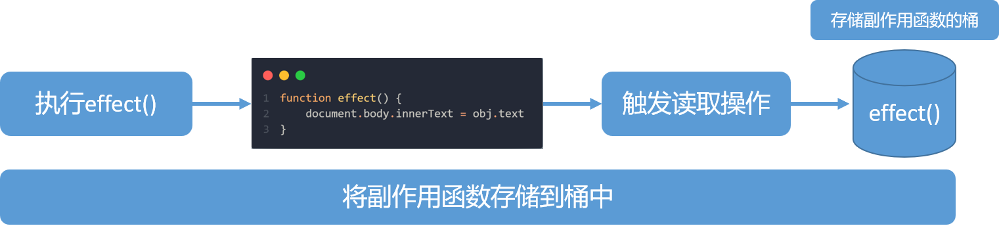
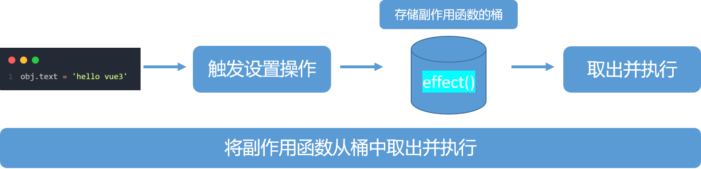
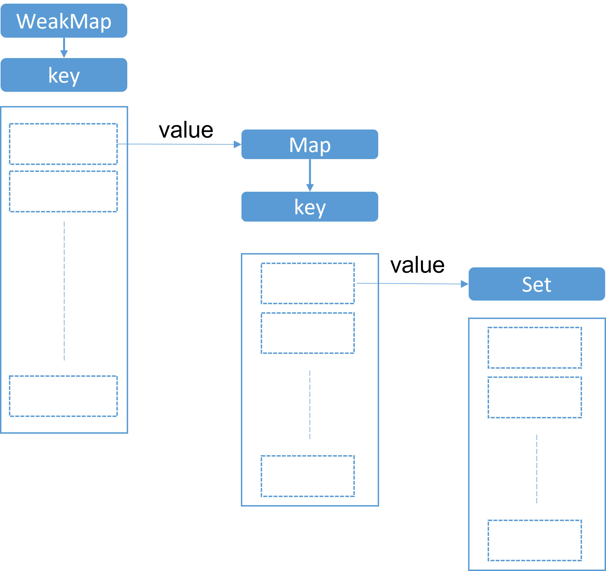
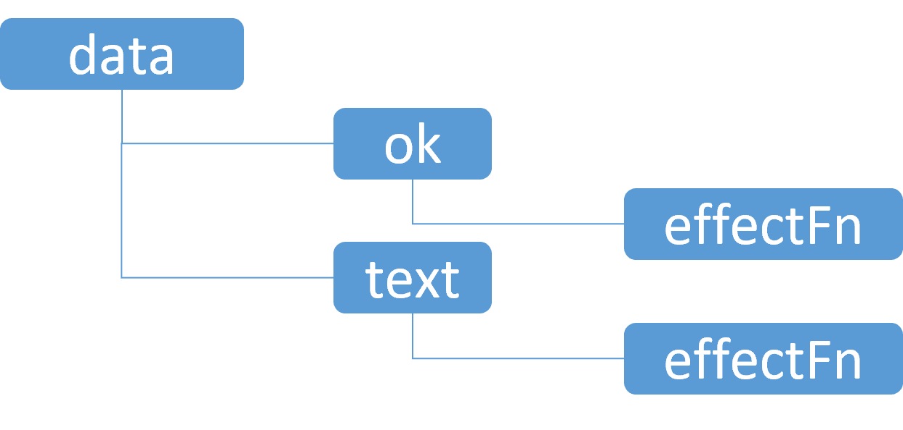

### 1. 响应式数据与副作用函数

副作用函数指的是会产生副作用的函数，如下边的代码：

```js
function effect () {
  document.body.innerText = 'hello Vue3'
}
```

当 effect 函数执行时，他会设置 body 的文本内容，但是除了 effect 函数外的任何函数都有可能读取或者设置 body 的文本内容。也就是说，effect 函数的执行会直接或间接影响其他函数的执行，这时我们说 effect 函数产生了副作用。副作用很容易产生。例如下边的代码，当一个函数修改了全局变量的时候，也发生了副作用。

```js
let val = 1 // 全局变量
function effect () {
  val = 3 // 修改全局变量，产生副作用
}
```

我们再来看一下什么是响应式数据，假设我现在有一个对象和一个副作用函数，这个副作用函数用到了对象中的某个属性。假设当对象中的属性发生变化时，副作用函数能够自动执行，那么该对象就是一个响应式数据。

```js
const obj = { text: 'hello vue3' }
function effect () {
  document.body.innerText = obj.text
}
obj.text = 'hello world' // 修改obj.text的值，希望副作用函数自动重新执行

```

显然这个对象仅仅是一个普通数据，不是一个响应式的数据，我们下一节会讨论如何实现一个简单的响应式数据

### 2. 响应式数据的基本实现
我们从响应式数据的定义可以得到两点线索：
  - 当副作用函数effect执行的时候，会触发字段的 **读取** 操作；
  - 当修改字段的值时，会触发字段的 **设置** 操作

为了实现上述两点，我们可以再读取字段时，将副作用函数effect存储到一个“桶”里边，然后当我们再设置值时，再把副作用函数effect从“桶”里取出来并执行。怎么实现这个副作用函数的存储和取出呢？我们可以用代理来实现！

将副作用函数effect存储到一个桶里边


取出effect函数并执行


### 3. 一个微型的响应式系统
```js
const bucket = new Set() // 存储副作用函数的桶
const data = { text: "hello world!" } // 原始数据

let activeEffect;
function effect(fn) { // 用于注册副作用函数
    activeEffect = fn;
    fn()
}


const obj = new Proxy(data, {
    get(target, key) {
        if (activeEffect) { // 当当前存在激活的副作用函数时，将激活的副作用函数存放进桶中
            bucket.add(activeEffect)
        }
        return target[key]
    },
    set(target, key, value) {
        target[key] = value // 设置属性值
        bucket.forEach(fn => fn()) // 把副作用函数从桶中取出来并执行
        return true // 返回true表示设置成功
    }
})
```
我们可以将以上代码粘贴到控制台中，并用以下代码进行验证。
```js
effect(()=>{
    console.log('effect run'); 
    document.body.innerText = obj.text
})

setTimeout(() => {
    obj.noExist = 'hello vue3'
}, 1000);
```
我们会发现控制台输出了两次`effect run`，**这是因为没有在副作用函数与被操作的目标字段之间建立明确的联系**。导致了无论读取/设置的是哪一个属性，都会导致副作用函数被执行。
下边我们来给副作用函数和被操作的目标字段之间建立明确的联系。
```js
const bucket = new WeakMap(); 
const data = { text: "hello world!" } 
let activeEffect;
function effect(fn) {
    activeEffect = fn;
    fn()
}


function track(target,key){ // track 函数用于在拦截get操作的函数中，进行追踪变化
    if(!activeEffect) return; // 没有激活的函数，直接返回
    let depsMap = bucket.get(target) // 从桶中根据target取出副作用函数集合，因为同一个target往往会有多个值，所以depsMap是一个map类型， key==>effects
    if(!depsMap){
        bucket.set(target,depsMap = new Map()) // 如果这个集合不存在，就新建一个map赋值给depsMap,并和target建立联系
    }
    let deps = depsMap.get(key)// 从 depsMap中，根据key值读取相对应的函数集合，可能一个key对应多个effects，所以deps是一个Set类型
    if(!deps){
        depsMap.set(key,deps = new Set())// 如果该不存在，就新建一个Set赋值给deps,并和key建立联系
    }
    deps.add(activeEffect)// 将当前激活的副作用函数存储进桶里边
}

function trigger(target,key){ // trigger函数，用于拦截设置函数中出发副作用函数
    const depsMap = bucket.get(target)// 根据target从桶中取出depsMap
    if(!depsMap) return // 如果不存在，直接返回
    const effects = depsMap.get(key) // 根据key取出真正的副作用函数
    effects && effects.forEach(fn=>fn()) // 如果存在，执行副作用函数
}

const obj = new Proxy(data,{
    get(target,key){
        track(target,key)  // 在get中调用track函数
        return target[key]
    },
    set(target,key,value){
        target[key] = value
        trigger(target,key) // 在set中调用trigger函数
    }
})
```
我们可以将以上代码粘贴到控制台中，并用以下代码进行验证。
```js
effect(()=>{
    console.log('effect run'); 
    document.body.innerText = obj.text
})

setTimeout(() => {
    obj.noExist = 'hello vue3'
}, 1000);
```
经过验证，可以发现，控制台只输出了一次`effect run`。
目标对象和其对应的副作用函数集关系如下图：

最外层的收集副作用函数的桶之所以为WeakMap的形式，主要是为了节约内存开支。WeakMap的详细知识详见[阮一峰大佬的文章](https://wangdoc.com/es6/set-map#weakmap)。

### 4. 分支切换与cleanup
```js
const bucket = new WeakMap();

const data = { ok: true, text: 'hello world' }
let activeEffect;
function effect(fn) {
    activeEffect = fn;
    fn()
}

const obj = new Proxy(data, {
    get(target, key) {
        debugger
        track(target, key)
        return target[key]
    },
    set(target, key, value) {

        target[key] = value
        trigger(target, key)
    }
})

function track(target, key) {
    if (!activeEffect) return;
    let depsMap = bucket.get(target)
    if (!depsMap) {
        bucket.set(target, depsMap = new Map())
    }
    let deps = depsMap.get(key)
    if (!deps) {
        depsMap.set(key, deps = new Set())
    }
    deps.add(activeEffect)
}

function trigger(target, key) {
    const depsMap = bucket.get(target)
    if (!depsMap) return
    const effects = depsMap.get(key)
    effects && effects.forEach(fn => fn())
}


effect(function effectFn() {
    console.log('副作用函数执行啦')
    document.body.innerText = obj.ok ? obj.text : 'not'
})
```
如上代码所示，我们在副作用函数effectFn内部写了一个三元表达式，根据字段obj.ok的值不同会执行不同的分支语句，这就是所谓的分支切换。分支切换可能会产生遗留的副作用函数。就用上边的代码来举例，当这些代码执行完毕后，响应式数据和effectFn之间已经建立了如下的关系：

当我们将obj.ok的值修改为false并触发副作用函数执行后，此时obj.text字段不会被读取，所以理想情况下，obj.text并不应该收集effectFn。但是目前的代码还不能做到这种效果，此时就产生了遗留的副作用函数。

我们先修改obj.ok的值为false
```js
obj.ok = false;
```
然后，再修改obj.text的值
```js
obj.text = 'hello vue3'
```
即使这个时候页面的值是不需要发生变化的，副作用函数依然被触发了！

解决这个问题的思路很简单，每次副作用函数执行时，我们可以先把它从所有与之关联的集合中删除，当副作用函数执行完毕后，再重新建立联系，但在新的联系中不会包含遗留的副作用函数。
